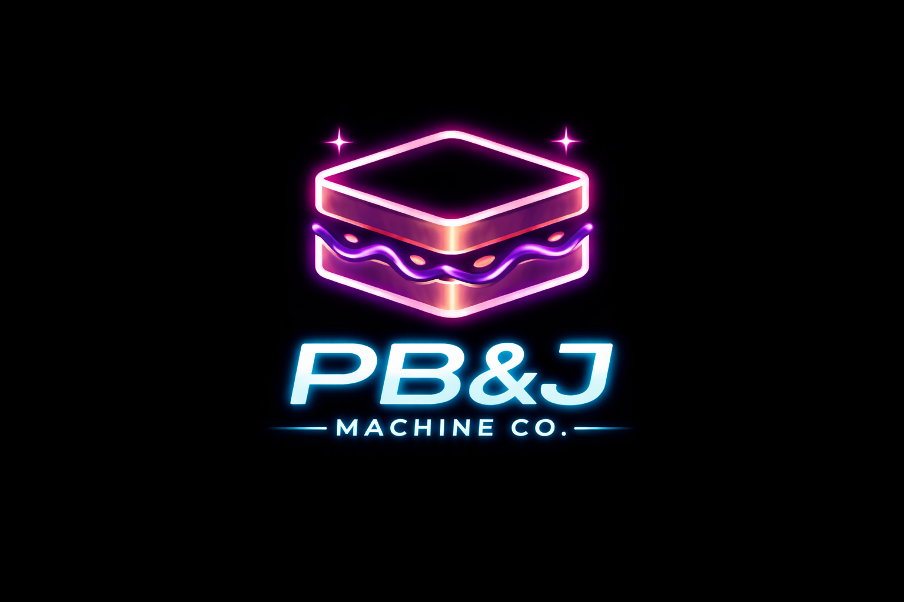

  

# PB&J Machine Company

A collection of example documents for a fictional software company — all written about the same product, across every layer of company documentation.

## Why This Exists

Most documentation guides tell you *what* to write. They don't show you. This repo is the "show you" part.

Every example is set in the same fictional company: a team building the software interface for a magic peanut butter and jelly sandwich machine. The subject matter is intentionally simple — you already know how a PB&J works. That way the focus stays on the writing, not the domain.

  

Each document demonstrates a different document type you'd find in a real software company: product visions, feature specs, technical explorations, and more. Same company, same product, different purposes and audiences.

## Naming Convention

Files follow the pattern `{prefix}_{descriptive-name}.md`.

The prefix is a short identifier for the document type. The suffix describes the specific topic. You can tell what kind of document you're looking at without opening it.

**Recognized document types:**

| Prefix | What It Is |
|---|---|
| `pv` | Product vision — why the company exists and where it's going |
| `qp` | Quarter plan — goal, requirements, stretch goals, and phased work order for a single quarter |
| `fsp` | Feature spec — the shape of one piece of work: function signatures, inputs and outputs, error handling, and edge cases. Zooms into how a single step gets built. Reach for one when the shape needs settling before code exists |
| `cpf` | Core product flow — the critical path through a system at any altitude |
| `exp` | Exploration — engineering investigation into a problem space |
| `kb-op` | Knowledge base (operational) — step-by-step reference for how a specific system or mechanism works, with code references |
| `kb-con` | Knowledge base (conceptual) — mental model for how something works as a whole; no steps or filenames |
| `pm` | Postmortem — what went wrong, why, and what we're doing about it |
| `tkt` | Ticket — scoped unit of work with acceptance criteria and implementation context |
| `sop` | Standard operating procedure — step-by-step procedure for an LLM to follow |
| `plg` | Plugin — an extension loaded at a fixed point in a session, either a standing constraint held for the whole session or a conditional procedure run when its trigger is met |
| `rdm-repo` | Repo README — entry point for a codebase; what it does, how to run it, how to contribute |
| `rdm-project` | Project README — LLM orientation doc for an MDP project; what it is, where things live, current state |
| `rdm-wiki` | Wiki README — the front door of a documentation directory; what it governs, an index of its children, and the shared rules that belong to none of them |
| `ctb` | Contributing — architecture overview, dev setup, and testing guidelines for contributors. Applies to a documentation collection as well as a codebase |
| `prd` | PR description — what changed, why, how to review it, and how to test it |
| `rln` | GitHub release notes — what shipped, why it matters, and how to upgrade |
| `plan` | Implementation plan — the sequence and scope of a body of work: what's being built, in what order, what's in and out, and where it currently stands. Answers *what happens and in what order*, not *how each piece is shaped*. The default document for any multi-step work |
| `nb` | Notebook — the record kept while executing a hands-on operation, written entry by entry as the work happens. Verbatim commands and output, retained failures, and a register of what now exists. Read afterward to reproduce a step or to extract a standard from what was settled |
| `sa` | Self-assessment — quarterly or annual reflection on what happened, how the individual showed up, what they learned, and where they are heading. Written as a narrative rather than a list of accomplishments. |

## Organization

Examples are organized into categories that mirror the layers of documentation in a software company — from highest altitude to most operational. Inside a category, each document type gets its own directory holding a README that describes the type and every example of it.

READMEs are their own category because they are front-door documents rather than a layer — the thing they front decides the audience.

| Category | What It Covers | Examples |
|---|---|---|
| **[strategic/](strategic/)** | Why we exist, where we're going | `pv_pbj-co.md` |
| **[product/](product/)** | What we're building and why | `fsp_artisan-spread-selection.md`, `cpf_sandwich-assembly.md`, `cpf_assembly-pipeline.md` |
| **[engineering/](engineering/)** | How we build it | See `engineering/` — organized into `tickets/`, `plans/`, `shipping/`, `explorations/`, `notebooks/` |
| **[operations/](operations/)** | How we run it | See `operations/` — `knowledge-base/` for reference docs, flat for postmortems |
| **[communication/](communication/)** | Status, alignment, reflection | — |
| **[people/](people/)** | Personal reflection and performance artifacts | `sa_pbj-co.md` |
| **[llm/](llm/)** | SOPs and plugins — documents that tell an LLM how to act within a defined workflow | `sop_account-checkin.md`, `plg_machine-targeting.md`, `plg_shift-handoff.md` |
| **[readmes/](readmes/)** | Front-door documents, organized by what they front — `repos/`, `contributing/`, `projects/`, `wikis/` | See `readmes/` |
| **[developer/](developer/)** | Setup guides and how-to docs for working in a codebase | `kb_vscode-shell-command.md` |

Each category has its own README describing the audience, purpose, and full list of document types — including the ones that haven't been written yet.

## How to Use These

When you're about to write a document, find the matching example here. Read it to see how that document type works in practice — the structure, the altitude, the level of detail, and how it addresses its audience. Then write yours.

## Contributing

This is an evolving collection. New examples get added as new document types are written. If a category shows "—" in the table above, that just means it's next on the list.

Adding an example, adding a document type, or changing one is governed by [`CONTRIBUTING.md`](CONTRIBUTING.md).
